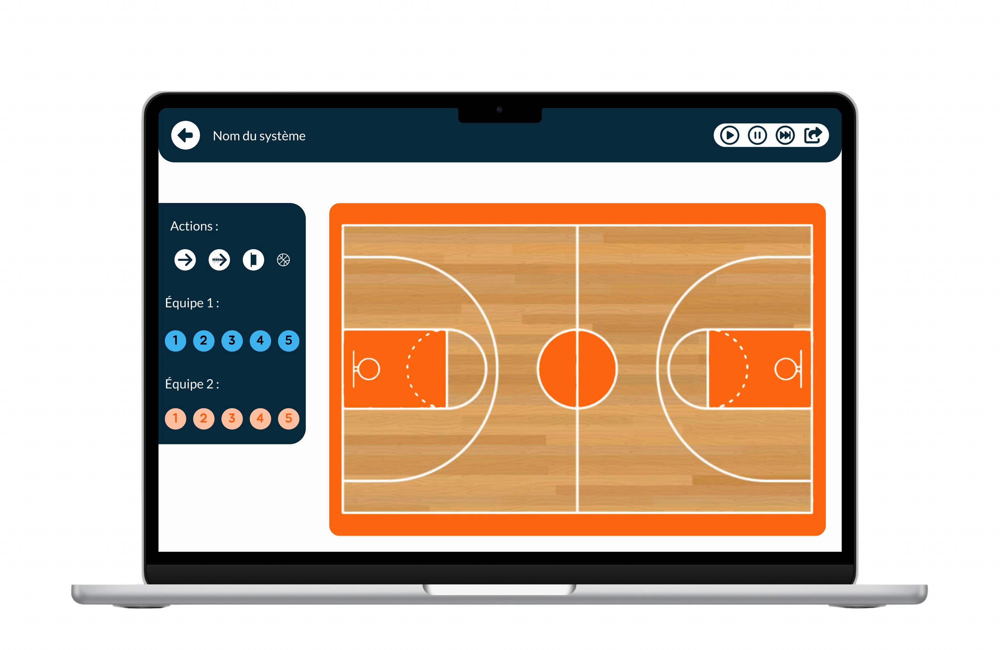

# 🏀 Zone Tactics

<div align="center">

[](https://nextjs.org/)
[](https://www.typescriptlang.org/)
[](https://tailwindcss.com/)
[](https://vercel.com)

**Créateur de tactiques basketball professionnel**
*Le nouveau moyen de créer et d'expliquer ses tactiques*

[🚀 Demo Live](#) • [📖 Documentation](./CLAUDE.md) • [🐛 Report Bug](https://github.com/thomaslekieffre/Zone-Tactics/issues) • [✨ Request Feature](https://github.com/thomaslekieffre/Zone-Tactics/issues)

</div>

---

## 📋 Table des matières

- [À propos](#-à-propos)
- [Fonctionnalités](#-fonctionnalités)
- [Screenshots](#-screenshots)
- [Installation](#-installation)
- [Utilisation](#-utilisation)
- [Technologies](#-technologies)
- [Structure du projet](#-structure-du-projet)
- [Configuration](#-configuration)
- [Contribution](#-contribution)
- [Licence](#-licence)
- [Contact](#-contact)

## 🎯 À propos

**Zone Tactics** est une plateforme SaaS innovante conçue spécialement pour les coachs de basketball. Elle permet de créer et partager des tactiques dynamiques avec des animations interactives, facilitant ainsi la communication entre entraîneurs et joueurs.

### ✨ Pourquoi Zone Tactics ?

- **🎨 Interface intuitive** : Création de tactiques par simple glisser-déposer
- **🎬 Animations fluides** : Visualisation en temps réel des mouvements
- **🎙️ Commentaires vocaux** : Ajout d'explications audio pour chaque tactique
- **📱 Responsive mobile** : Utilisation optimisée sur tous les appareils
- **🔗 Partage facile** : Liens uniques pour partager les tactiques avec l'équipe
- **📚 Bibliothèque personnelle** : Sauvegarde et organisation des stratégies

## 🚀 Fonctionnalités

### 🏀 Création de tactiques
- **Terrain interactif** avec dimensions réelles
- **Positionnement des joueurs** par glisser-déposer
- **Animations de mouvements** fluides et personnalisables
- **Trajectoires de balle** et passes
- **Flèches directionnelles** pour les déplacements
- **Mode présentation** pour l'affichage plein écran

### 🎙️ Système audio
- **Enregistrement vocal** intégré
- **Commentaires par séquence** d'animation
- **Lecture synchronisée** avec les mouvements

### 📱 Experience mobile
- **Interface adaptative** pour smartphones et tablettes
- **Mode paysage optimisé** pour la visualisation
- **Navigation mobile intuitive** avec menu hamburger
- **Gestes tactiles** supportés

### 👥 Gestion d'équipe
- **Système d'abonnement** avec Stripe
- **Authentification sécurisée** via Clerk
- **Bibliothèque personnelle** de tactiques
- **Partage par liens** uniques et sécurisés

### 📊 Performance
- **Optimisation d'images** avec Next.js Image
- **Lazy loading** automatique
- **Bundle optimisé** pour la production
- **SEO friendly** avec métadonnées

## 📸 Screenshots

<div align="center">

### 🖥️ Version Desktop


### 📱 Version Mobile
*Interface responsive optimisée pour tous les appareils*

</div>

## 🛠️ Installation

### Prérequis
- **Node.js** 18+
- **npm** ou **yarn**
- **Git**

### 1. Cloner le repository
```bash
git clone https://github.com/thomaslekieffre/Zone-Tactics.git
cd Zone-Tactics
```

### 2. Installer les dépendances
```bash
npm install
# ou
yarn install
```

### 3. Configuration des variables d'environnement
Créer un fichier `.env.local` :
```env
# Clerk Authentication
NEXT_PUBLIC_CLERK_PUBLISHABLE_KEY=your_clerk_publishable_key
CLERK_SECRET_KEY=your_clerk_secret_key
NEXT_PUBLIC_CLERK_COOKIE_DOMAIN=localhost

# Stripe Payment
NEXT_PUBLIC_STRIPE_PUBLISHABLE_KEY=your_stripe_publishable_key
STRIPE_SECRET_KEY=your_stripe_secret_key

# Vercel Blob Storage
BLOB_READ_WRITE_TOKEN=your_blob_token
```

### 4. Lancer le serveur de développement
```bash
npm run dev
# ou
yarn dev
```

Ouvrir [http://localhost:3000](http://localhost:3000) dans votre navigateur.

## 🎮 Utilisation

### Démarrage rapide

1. **Créer un compte** via l'interface Clerk
2. **Souscrire un abonnement** (5€/mois)
3. **Accéder au créateur** de tactiques
4. **Positionner les joueurs** sur le terrain
5. **Créer des animations** de mouvements
6. **Ajouter des commentaires** vocaux
7. **Sauvegarder et partager** vos tactiques

### Commandes disponibles

```bash
# Développement
npm run dev          # Lance le serveur de développement
npm run build        # Build de production
npm run start        # Démarre le serveur de production
npm run lint         # Vérification ESLint

# Tests et qualité
npm run type-check   # Vérification TypeScript (si configuré)
```

## 🧰 Technologies

### Frontend
- **[Next.js 14](https://nextjs.org/)** - Framework React avec SSR/SSG
- **[TypeScript](https://www.typescriptlang.org/)** - Typage statique
- **[Tailwind CSS](https://tailwindcss.com/)** - Framework CSS utilitaire
- **[Framer Motion](https://www.framer.com/motion/)** - Animations fluides
- **[React DnD](https://react-dnd.github.io/react-dnd/)** - Glisser-déposer

### Backend & Services
- **[Clerk](https://clerk.dev/)** - Authentification et gestion utilisateurs
- **[Stripe](https://stripe.com/)** - Paiements et abonnements
- **[Vercel Blob](https://vercel.com/storage/blob)** - Stockage de fichiers
- **[React Feather](https://github.com/feathericons/react-feather)** - Icônes

### Development Tools
- **[ESLint](https://eslint.org/)** - Linting JavaScript/TypeScript
- **[PostCSS](https://postcss.org/)** - Traitement CSS
- **[Autoprefixer](https://github.com/postcss/autoprefixer)** - Préfixes CSS automatiques

## 📁 Structure du projet

```
Zone-Tactics/
├── public/                 # Assets statiques
│   ├── img/               # Images et logos
│   └── favicon.ico        # Favicon
├── src/
│   ├── components/        # Composants React réutilisables
│   │   ├── Header.tsx     # En-tête avec navigation
│   │   ├── Footer.tsx     # Pied de page
│   │   └── withSubscription.tsx # HOC premium
│   ├── hooks/             # Hooks React personnalisés
│   │   ├── useSubscription.ts   # Gestion abonnements
│   │   └── useIsMobile.ts      # Détection mobile
│   ├── lib/               # Utilitaires et services
│   │   ├── stripe.ts      # Configuration Stripe
│   │   └── subscription.ts # Logique abonnements
│   ├── pages/             # Pages Next.js
│   │   ├── api/           # Routes API
│   │   ├── createsystem.tsx # Créateur de tactiques
│   │   ├── library.tsx    # Bibliothèque utilisateur
│   │   ├── pricing.tsx    # Page d'abonnement
│   │   └── index.tsx      # Page d'accueil
│   ├── styles/            # Styles globaux
│   └── config/            # Configuration
├── .claude/               # Configuration Claude Code
├── CLAUDE.md             # Documentation développeur
├── tailwind.config.js    # Configuration Tailwind
├── tsconfig.json         # Configuration TypeScript
└── package.json          # Dépendances et scripts
```

## ⚙️ Configuration

### Stripe
1. Créer un compte [Stripe](https://stripe.com/)
2. Récupérer les clés API (publishable et secret)
3. Configurer les produits et prix dans le dashboard
4. Ajouter les webhooks pour les événements d'abonnement

### Clerk
1. Créer une application sur [Clerk](https://clerk.dev/)
2. Configurer les méthodes d'authentification
3. Récupérer les clés API
4. Configurer les redirections après connexion

### Vercel Blob
1. Créer un projet sur [Vercel](https://vercel.com/)
2. Activer Vercel Blob Storage
3. Récupérer le token d'accès
4. Configurer les permissions de lecture/écriture

## 🤝 Contribution

Les contributions sont les bienvenues ! Voici comment contribuer :

### 1. Fork du projet
```bash
git clone https://github.com/votre-username/Zone-Tactics.git
```

### 2. Créer une branche
```bash
git checkout -b feature/nouvelle-fonctionnalite
```

### 3. Commit des changements
```bash
git commit -m "feat: ajout nouvelle fonctionnalité"
```

### 4. Push vers la branche
```bash
git push origin feature/nouvelle-fonctionnalite
```

### 5. Ouvrir une Pull Request

### Guidelines de contribution
- ✅ Suivre les conventions de commit [Conventional Commits](https://www.conventionalcommits.org/)
- ✅ Tester les changements localement
- ✅ Respecter les standards ESLint/TypeScript
- ✅ Documenter les nouvelles fonctionnalités
- ✅ Responsive mobile obligatoire

## 📝 Licence

Ce projet est sous licence **MIT**. Voir le fichier [LICENSE](LICENSE) pour plus de détails.

## 📞 Contact

**Thomas Le Kieffre** - Développeur
- 📧 Email: [thomas.lekieffredev@gmail.com](mailto:thomas.lekieffredev@gmail.com)
- 🐦 Twitter: [@thomasdev59](https://x.com/thomasdev59)
- 🔗 LinkedIn: [Thomas Le Kieffre](https://linkedin.com/in/thomas-le-kieffre)

**Équipe Zone Tactics**
- 📧 Contact projet: [contactdev@zonetactics.fr](mailto:contactdev@zonetactics.fr)
- 🎨 Design: [zoe.marchal10@gmail.com](mailto:zoe.marchal10@gmail.com)

**Liens du projet**
- 🌐 Repository: [https://github.com/thomaslekieffre/Zone-Tactics](https://github.com/thomaslekieffre/Zone-Tactics)
- 🚀 Demo live: [Zone Tactics](https://zone-tactics.vercel.app) *(si déployé)*
- 📊 Issues: [GitHub Issues](https://github.com/thomaslekieffre/Zone-Tactics/issues)

---

<div align="center">

**Fait avec ❤️ pour la communauté basketball**
*Zone Tactics - Révolutionnez votre coaching !*

⭐ **N'oubliez pas de star le projet si il vous plaît !** ⭐

</div>